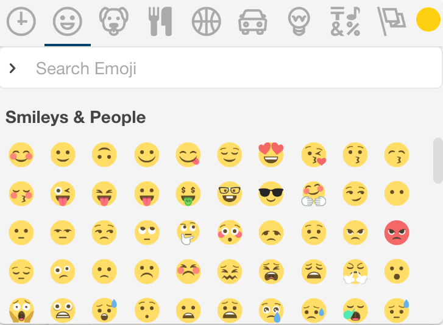

# Rocket.Chat tutorial for [The Adansonia Project](https://adansonia.net/)

## Welcome! :bowtie: 

[Rocket.Chat](https://rocket.chat/) is a chat platform that enables you to connect with fellow entrepreneurs. It's useful for

* exchanging ideas :bulb:
* supporting each other in your business projects :briefcase:
* and discussing topics of common interest :iphone: :mortar_board: :satellite: :pill: :book: :factory: :taxi: :tractor: :egg: :necktie: :tropical_drink:

Never used Rocket.Chat before? Don’t worry! This tutorial will teach you how to use it. 

Why learn to use Rocket.Chat? It's open source, free to use, and gaining traction. So it might be useful for communication among the team in the business that you're creating.

---

## :fast_forward: Key takeaways

1. [Install and set up Rocket.Chat](#installing-and-setting-up-rocketchat): 
	- [:arrow_down: Download Rocket.Chat](https://rocket.chat/download) on your smartphone :iphone: or computer :computer:
	- Enter the server name sent to you in an email
	- Create a username and password
1. [Public channels](#understanding-channels) are like a coffeeshop or a market: a public place to meet and discuss. [Private groups](#understanding-channels) are like a secret meeting with your closest advisors.
1. [Create your own public channel](#create-a-public-channel-for-your-business-project) about your business idea.
	* Put `p-` at the beginning of the channel name to mark it as a **p**roject. Give the channel a descriptive name such as `p-urban-farm`. 
	* [:pushpin: Pin](#pushpin-pinning-messages) your most important messages so that people can quickly understand your business project and help improve it.
1. Find other projects and try to help them with their business ideas. They may thank you with a token that could win you a prize! :money_with_wings:
1. Reward entrepreneurs who have given the most useful comments on your business idea by [giving them tokens](#tokens). 
1. Create public channels for general topics that you want to discuss with others, such as `#apps` and `#agriculture`. Announce the channel to everyone in `#general`.
1. [Mention](#mention-someone-to-get-their-attention-wave) other users by writing `@name` to notify them. Use [emojis](#say-it-with-an-emoji-grin) to enliven your messages. :smiley: :sparkles: :tada:
1. Confused about using Rocket.Chat? :confused: Ask for help in the channel `#rocket-help` or look for answers in the [official Rocket.Chat documentation](https://rocket.chat/docs/user-guides/).

---

## Installing and setting up Rocket.Chat

1. [:arrow_down: Download Rocket.Chat](https://rocket.chat/download) on as many devices as you want (Android, iOS, Mac, Windows, Linux).
2. Open the app and **enter the server name** that we sent to you via email. The server name looks like `<server-name>.rocket.chat`. Press <kbd>CONNECT</kbd>.
3. Create a **username and password**:
	* Click on <kbd>Register new account</kbd> and fill in all the required information.
	* We suggest that your **username** be your **first name and last name separated by a dot**. For example: `Barack.Obama`. That way, people can easily find you. 
	* When you are done, press <kbd>SUBMIT</kbd>, and you will see the homepage of the chat.

The video below illustrates steps 2 and 3:

### Add a profile picture :man_with_turban: :older_woman: :japanese_ogre:

Add a profile picture so that others can associate a face (or a business logo) to your name:

- On the mobile app, tap on the three horizontal lines in the top-left corner to open the main menu.
- Tap on your username on the top.
- Tap on `My account`.
- Tap on `Avatar`.
- To upload a picture, click on `Select file` and choose a picture from your phone or computer. 

If you don’t upload a photo, your default avatar will be your initials. 

## Understanding channels

Conversations in Rocket.Chat are organized into **channels**. Channels are chat rooms with many useful features. There are three kinds of channels: 

1. **Public channels** are open spaces for discussion. Conversations in public channels are like those you have at a market or a city square. Everyone can 

	- **see** all public channels;
	- **preview** the contents of all public channels;
	- **join** any public channel (i.e., become a member of any channel).

2. **Private Groups** are closed channels. Only the members of a private group know that it exists and can see its contents. The person who creates a private group is the **owner**. The owner can 

	* :envelope: invite people to join the private group; and
	* :boot: kick people out of it.

3. **Direct Messages** are private, 1-on-1 conversations. Think of a Direct Message as a private group with only two members.

On the mobile app, swipe from left to right to see the list of channels appear on the left-hand side:

### Each channel has a list of _members_

To see the members, tap on a channel in the list of channels to open it, and then tap on the  icon on the right-hand side.

## Discuss business ideas

### Create a public channel for your business project

:bangbang: **Everyone should create a public channel dedicated to their business proposal.** :bangbang:

This channel lets you share your business ideas with fellow entrepreneurs and get feedback from them. 

1. Tap on the three horizontal bars to bring up the menu on the left.
- Click on the  next to `CHANNELS`.
- **Choose a channel name** that 
	- begins with `p-` so that it is easy to identify channels dedicated to **p**rojects;
	- ends with a description of the project, with words separated by hyphens `-`, or underscores `_`.
	
	For example: `p-urban-farm` or `p-taxi_app`.
- When you are done, press .

Now your project channel is ready! :tada: 

**Announce your channel** by writing a message in the public channel `#general`. Everyone is a member of `#general`. Refer to your project channel with a `#` at the beginning (such as `#p-urban-farm`) so that a link to your channel is automatically created. 

By the way, use `#general` to send all kinds of announcements: about new channels you've created, ideas you want to discuss, or expertise you're searching for. 

If you want to discuss a certain topic such as `#apps` or `#internet-of-things`, **create a separate public channel for it**. Announce your new channel in `#general`, and invite users by typing the command `/invite @user` in your channel. Keep off topic discussion in the channel called `#random`.

### :pushpin: Pinning messages
An important feature is **pinning messages**. We recommend that you pin the most important messages in your project channel, such as:

- summaries of your business proposal;
- questions that you have that others may help you with.

When people join your project channel, they can easily understand your project by reading the pinned messages without having to scroll through the entire message history :relieved:.

To pin a message: 

1. click on the  icon next to the message;

1. click on the pin icon 

Everyone can see the pinned messages of a channel by clicking on the  icon in the tool bar on the right.  

### Making your project discussion private

We recommend that you keep your project channel public, at least for a while. Your ideas should reach as many fellow entrepreneurs as possible; otherwise you won’t get the chance to find valuable contributors! 

After a while, you may want to continue discussion in a private group. To do so, you can either

1. **create a new channel that is private** by checking the box `PRIVATE GROUP` when you create the channel;

	

2. or **convert a public channel to a private group** by opening the channel and then clicking on the  icon.

## Channel operations

### Joining a channel
Now you are ready to start! You have a username, a channel and... a business idea to share and get feedback on from fellow entrepreneurs. And you can help others with their business ideas.

To browse existing channels: 

- click on the  button on the left-hand pane;
- click on the name of a channel to preview its discussion;
- if you find an interesting channel, join it by clicking on the  button.

### :star: Favorite channels

All these channels may become difficult to handle: people like chatting, and channels may proliferate! To organize and prioritize your communications, we recommend you **favorite** (or **star**) channels, private groups, and DMs. 

To favorite a channel, click on the star icon in the upper left hand corner of the message area (next to the room name):

Then the star becomes yellow:

Now the channel will appear under the list of **Favorites** in the left-hand:

Starring helps you to focus on what's important to you.

### Hiding and leaving channels

You may realize after joining a channel that you are no longer interested in it. Don't worry; it's never too late to leave a channel! There are two ways to exit:

1. You can **hide** to remove it from your list of channels. You still remain a member of the channel.
	- :computer: On the desktop app, hover your mouse over the channel in the list of channels on the left-hand side, and click on the  button.
	- :iphone: On the mobile app, pull from the left-hand side to see the list of open channels, hold down on the channel name to bring up the buttons, and click on the  button.
2. You can **leave** a channel, which will remove it from your list of channels and remove you as a member of the channel.
	- :computer: On the desktop app, hover your mouse over the channel in the list of channels on the left-hand side, and click on the  button.
	- :iphone: On the mobile app, enter the message `/leave` or `/part` in the channel. 

## Messaging :page_with_curl:

Type messages in the message box and press <kbd>&#x23ce;</kbd> (<kbd>Enter</kbd>) or the send button . If you want to send multiple lines of text, press <kbd>&#x21E7;</kbd> <kbd>&#x23ce;</kbd> (<kbd>Shift</kbd> <kbd>Enter</kbd>) to move to the next line.

### Mention `@someone` to get their attention :wave:

To get someone’s attention, type `@` followed by their username, for example `@Barack.Obama`. (Rocket.Chat automatically completes someone's username as you type it.) Then your friend `@Barack.Obama` will see a red badge on the channel and will be notified via email or his mobile device.
 
To notify everyone in a channel, write `@all`. But remember, `@all`  notifies _everyone_! It can be useful for important announcements. But it can be distracting if abused, so use `@all` sparingly.

### Referring to previous messages :point_up_2:

To refer to a previous message in a conversation, you can grab a link to a certain message:

- :computer: On the desktop app, hover the mouse over a message, click on the gear icon , and click on the link . 
- :iphone: On the mobile app, press and hold on a message, click on `Permalink`. 

This copies to your clipboard a link to that message. Paste that link into a new message to create a clickable link and a preview to the old message.

### Say it with an emoji! :grin:

To insert emoji in a message, hit the emoji button  to the right of the text input to open an emoji picker:

You can also type your desired emoji by wrapping its name with `:`. For example, `:heart:` produces :heart:.

### Emoji reactions

You can also _react_ to a message with an emoji. 

 - On the **desktop** application: hover over a message, click on the gear icon , click on the smiling face icon

	
	
 - On the **mobile** application: press and hold your finger on a message to bring up a menu, press `Reactions`

Then choose an emoji from the emoji picker, and the emoji appears below the message: 

To remove an emoji reaction, click on the emoji below the message. To reiterate an existing emoji reaction that someone else posted, click on that emoji to add to that emoji's counter.

## Tokens

Discussing your business ideas with others can improve them. 

:bangbang: **To acknowledge other entrepreneurs for their ideas and contributions, thank them by giving them a _token_**. :bangbang:

Giving a token to someone is a way to say

> Thank you! You have really helped me with my business plan. Let's keep interacting!

At the end of the contest, venture capitalists and other investors will evaluate business plans. They will also decide which ones they want to fund. 

**If you hold a token given by someone whose business plan was highly rated by the investors, then that token is a lottery ticket :ticket: for a prize:** 

- :airplane: :school: :briefcase: :city_sunrise: The prize is an all-expenses-paid trip to Milan :it: for a business training course at the [Business School of Bocconi University](http://www.unibocconi.eu/), one of the best business schools in Europe. The cost of this intensive course, lodging, and travel will be fully covered. There may also be an opportunity to pitch to investors in Milan. 
- **The more you help others with their projects, the more tokens you will be given, and the more chances you have at winning this prize.**

### Giving tokens

Everyone begins with **only 5 tokens**, so give them wisely.

To transfer tokens, we have created a "bot" named `@token`. This bot is a robot 🤖 who is a member of your team. This bot responds to certain commands. You can talk to `@token` in a direct message or in any public channel.
 
To give a token to `@someone`, send the message `/give @someone` in any public channel or in a direct message to `@token`:

The bot `@token` responds by confirming that you successfully gave a token to that user, and `@token` tells you how many tokens you have left to give. 

To thank someone for significantly helping your business plan, you can give them _multiple tokens_. You can do so using multiple `/give @someone` commands. Or you can send multiple tokens all at once by writing `/give 3 @someone` or `/give all @someone`:

### Revoking tokens

Did you regret giving a token to someone? You can revoke it with the command `/revoke @someone`:

You can also revoke more than one token by writing `/revoke 2 @someone`.

### Who has the most tokens?

To find out who currently has the most tokens (given to them by other people), send the message `/leaderboard` in a public channel or in a direct message with the `@token` bot. Then the `@token` bot responds to you in a direct message with the ranking:

### Status of my tokens

If you don't remember how many tokens you have, send the message `/status` in a public channel or in a direct message to the `@token` bot. Then the bot sends you a direct message that summarizes the tokens you have left to give, have given, and have received:

### Learn more about interacting with the `@token` bot

More details on how to send, receive, and check the status of tokens is available in [this token-bot user guide](https://github.com/cbrummitt/token-bot/wiki/@token-bot-cheat-sheet).

## Advanced topics

### :mag: Search messages

Rocket.Chat allows you to search within channels for messages that you want to see again. To do so, just click on the **search icon**  in the vertical toolbar on the right. In the search bar, type one or more keywords included in the chat message that you want to find. 

### Set the topic of a channel

In addition to 

- choosing a [descriptive name for your project's channel](#create-a-public-channel-for-your-business-project) and
- [pinning important messages](#pushpin-pinning-messages) that summarize your project

you can help users understand your project by setting a **topic** for your project channel. A topic is a small amount of text that appears in small, gray font next to your channel name: 

Keep the topic short because not much can fit next to the channel name. To assign a topic to your channel, you can either

1. write the command `/topic growing vegetables on rooftops`;
2. or click on the information icon  and click on the pencil button  under **Topic**.

### :pencil2: Editing messages 

You can edit a message in Rocket.Chat after you have sent it. 

-  :iphone: On the mobile app, press and hold on a message to bring up the menu, and click on `Edit`. 
-  :computer: On the desktop app, click on the gear icon  next to the message, and then click on the pencil icon . Alternatively, hit the <kbd>Up Arrow</kbd> in the message input box.

Then the message box has a yellow background, meaning that you can edit the message. Then hit the send button . Now  appears next to that message.

You can also **delete** a message: 

-  :iphone: On the mobile app, press and hold on a message to bring up the menu, and click on `Delete`. 
-  :computer: On the desktop app, click on the gear icon  next to the message, and then click on the trash icon .

Another way to delete a message is to edit the message to have no content.

### Online, Away, Busy, and Invisible

At the top of the main menu, you see your username. If you click on it, then you can change your status between Online, Away, Busy, and Invisible:

If you choose "Invisible", then others will think that you are not online. But we don't recommend you be an invisible ghost :ghost:!

## Passwords and logging in

### :worried: Help, I can't log in to Rocket.Chat!

There are a few common reasons for being unable to log in: 

1. **Forgotten password**: If you are unable to log into Rocket.Chat, first try resetting your password. The login screen has a button <kbd> Forgot your password </kbd>.  
1. **Updating files takes a long time**. Rocket.Chat is being improved every week, so the app periodically asks you to update the software. If it takes a long time to update files, try quitting the app and opening it again. You could try skipping the update and wait to update the app until you are connected to wifi.
1. **Wrong server**: You may be trying to log into the wrong server. A Rocket.Chat server looks like `server-name.rocket.chat`, where `server-name` is replaced by the name of your server. (A Rocket.Chat server may also have `https://` in the beginning.) Your server name was sent to you in an email. The next section explains how to change the server you are trying to log into.

If you are still having trouble logging in, send [an email to Charlie](mailto:charles_brummitt@hms.harvard.edu).

#### Switching servers
If you belong to multiple servers on Rocket.Chat (such as `demo.rocket.chat` and one for the Adansonia Project), you can easily switch among them. 

- :computer: On the desktop app, the servers are listed on the far left-hand side. You can switch between servers by pressing <kbd>&#8984; Command</kbd> followed by a number.

	

- :iphone: On the mobile app, at the login screen where you enter your user name and password, **swipe up with two fingers** to bring up a screen at which you select the server: 

	

### :lock: Change your password

If you ever want to change your password, do the following:

- Open the main menu. 
	- :iphone: On the mobile app, tap on the three horizontal lines in the top-left corner to open the main menu
	- :computer: On the desktop app, make sure the window is large enough to see the list of channels on the left side; otherwise, click on the three horizontal lines in the top-left corner.
- Click on your username
- Click on `My account`
- Click on `Profile`

## Learn more at the [Rocket.Chat documentation](https://rocket.chat/docs/user-guides/)

- [Keyboard shortcuts](https://rocket.chat/docs/user-guides/keyboard-shortcuts/)
- [Setup desktop and push notifications](https://rocket.chat/docs/user-guides/notifications/)
- [Upload files](https://rocket.chat/docs/user-guides/file-uploads/)
